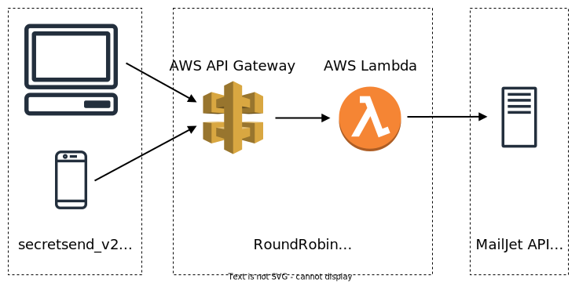

# Round Robin

> :warning: This entire project is called "SecretSend". This name was decided after this API was built, which is why naming is inconsistent between the front and back ends.

A REST-API that sends emails in a "Secret Santa" style to recipients. Deployed with AWS Gateway & Lambda. Utilises the https://www.mailjet.com/ API. Served by front-end: https://github.com/MugishaU/secretsend_v2.

This code along with the [front-end](https://github.com/MugishaU/secretsend_v2) were built from scratch with the aim of having functional code within one week.

## Usage

Served from front-end at https://secretsend.netlify.app/

## Architecture

Below is the architecture diagram for the entire SecretSend project. This repository only contains the backend portion of the project - "RoundRobin".
Both the burst & rate limit at the API Gateway level are set to 10, to protect the infrastructure from abuse.

## Endpoints

### `Base URL`

https://p3h7zn74oj.execute-api.eu-west-2.amazonaws.com

### `GET /wake`

**Response**

_Code:_ `202 Accepted`

_Body Type:_ Application/JSON

_Body Content:_ `"awake"`

_Usage_: Can be used as a health check or to wake the lambda.

### `POST /email`

**Request**

_Body Type:_ Application/JSON

_Body Content:_

    {
        "mainUser": { "name": STRING, "email": STRING },
        "recipients": [
            { "name": STRING, "email": STRING },
            { "name": STRING, "email": STRING }
        ],
        "sendReport": BOOLEAN,
        "customSubject": STRING,  [OPTIONAL]
        "customTitle": STRING,    [OPTIONAL]
        "customMessage": STRING   [OPTIONAL]
    }

**Response**

_Code:_ `202 Accepted`

_Body Type:_ Application/JSON

_Body Content:_

    {
        "message": "Success",
        "errors": []
    }

_Usage_: Used to send emails to all recipients in a seret santa style.

## Issues

- No authentication on API due to difficulties in signing frontend calls with an AWS Signature. JWT's could be used instead. With AWS authentication enabled, the API could be easily called from POSTMAN, but couldn't replicate the behaviour from my front-end client & AWS documentation on the SDK usage is lacking.
